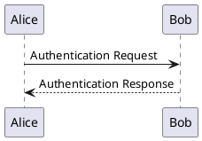

Vendor-shaped macro with optional dimensions:

```plantuml
@startuml
Alice -> Bob: Authentication Request
Bob --> Alice: Authentication Response
@enduml
```

Mandatory parameters only:

```plantuml
@startuml
:``Main Process``;
Jose -> Zoe: cafe ☕
@enduml
```
